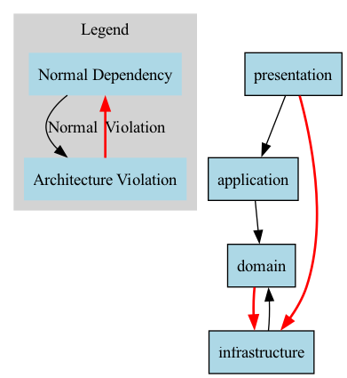

# GoArchTest

GoArchTest is a Go library for testing the architectural constraints of your Go applications. It is inspired by the .NET library [NetArchTest](https://github.com/BenMorris/NetArchTest), providing a fluent API to define and enforce architectural rules in your Go projects.

## Installation

```bash
go get github.com/solrac97gr/goarchtest
```

## Quick Start

Add architectural tests to your Go test files:

```go
func TestArchitecture(t *testing.T) {
    // Get project path
    projectPath, _ := filepath.Abs("./")
    
    // Test that presentation layer doesn't depend on data layer
    result := goarchtest.InPath(projectPath).
        That().
        ResideInNamespace("presentation").
        ShouldNot().
        HaveDependencyOn("data").
        GetResult()
        
    if !result.IsSuccessful {
        t.Error("Architecture violation: Presentation layer depends on data layer")
        for _, failingType := range result.FailingTypes {
            t.Logf("Violation in: %s (%s)", failingType.Name, failingType.Package)
        }
    }
}
```

> **💡 Why do I need this when Go prevents import cycles?** 
> Go only prevents circular dependencies (A→B→A), but allows architectural violations like inner layers depending on outer layers (domain→infrastructure). GoArchTest enforces proper architectural boundaries that Go's compiler cannot check. [Learn more →](./examples/import_cycles_vs_architecture)

## Why GoArchTest?

GoArchTest helps you:

- **Enforce architectural boundaries** between layers and modules
- **Detect architectural drift** early in the development process
- **Document architectural decisions** as executable tests
- **Ensure consistency** across large codebases and teams
- **Validate architectural patterns** like Clean Architecture, Hexagonal Architecture, etc.

## Why Do We Need This When Go Prevents Import Cycles?

While Go's compiler prevents **circular dependencies** (A imports B, B imports A), it doesn't prevent **architectural violations**. Here's why GoArchTest adds crucial value:

### Go's Import Cycle Protection vs. Architectural Rules

**What Go prevents:**
```go
// Go compiler ERROR: import cycle
package A
import "B"  // A imports B

package B  
import "A"  // B imports A - COMPILER ERROR
```

**What Go ALLOWS but violates Clean Architecture:**
```go
// Go compiler: ✅ COMPILES FINE
// Clean Architecture: ❌ VIOLATION
package domain
import "infrastructure"  // Inner layer importing outer layer

package infrastructure
import "domain"  // This is actually correct in Clean Architecture
```

### Real-World Architectural Problems Go Doesn't Catch

1. **Layer Violations**
   ```go
   // Domain importing infrastructure - Go allows, but breaks Clean Architecture
   package domain
   import "myapp/infrastructure/database"
   ```

2. **Skipping Layers**
   ```go
   // Presentation directly importing infrastructure - Go allows, but bad architecture
   package presentation  
   import "myapp/infrastructure/repository"  // Should go through application layer
   ```

3. **Wrong Direction Dependencies**
   ```go
   // Business logic depending on frameworks - Go allows, but creates tight coupling
   package business
   import "github.com/gin-gonic/gin"  // Business logic shouldn't know about HTTP frameworks
   ```

4. **Namespace Violations**
   ```go
   // User service importing order logic - Go allows, but violates bounded contexts
   package user
   import "myapp/order/internal"  // Cross-domain pollution
   ```

### The Value GoArchTest Provides

| Problem | Go's Protection | GoArchTest's Solution |
|---------|----------------|----------------------|
| Circular imports | ✅ Prevented | Not needed |
| Layer violations | ❌ Allowed | ✅ Detected and prevented |
| Architectural drift | ❌ Allowed | ✅ Detected over time |
| Team consistency | ❌ No enforcement | ✅ Automated checks in CI |
| Documentation | ❌ No formal way | ✅ Tests as living documentation |

### Example: Clean Architecture in Go

```go
// This compiles fine in Go but violates Clean Architecture:
package domain
import (
    "myapp/infrastructure/database"  // ❌ Inner layer depending on outer
    "myapp/presentation/http"        // ❌ Inner layer depending on outer  
)

// GoArchTest catches this violation:
func TestCleanArchitecture(t *testing.T) {
    result := goarchtest.InPath("./").
        That().
        ResideInNamespace("domain").
        ShouldNot().
        HaveDependencyOn("infrastructure").  // ❌ Test fails - violation detected!
        GetResult()
}
```

### Benefits in Large Codebases

- **Prevent architectural erosion** as teams grow
- **Onboard new developers** with clear architectural rules
- **Maintain code quality** across multiple teams and microservices
- **Enforce design patterns** consistently
- **Catch violations early** in CI/CD pipelines

GoArchTest bridges the gap between what Go's compiler enforces (import cycles) and what good software architecture requires (proper layer separation, dependency direction, and bounded contexts).

**📚 For a detailed practical example of these concepts, see [Import Cycles vs Architectural Violations Example](./examples/import_cycles_vs_architecture)**

## Detailed Usage Guide

```go
package main_test

import (
	"testing"
	"path/filepath"
	
	"github.com/solrac97gr/goarchtest"
)

func TestArchitecture(t *testing.T) {
	// Get the absolute path of the project
	projectPath, err := filepath.Abs("./")
	if err != nil {
		t.Fatalf("Failed to get project path: %v", err)
	}
	
	// Create a new Types instance for the project
	types := goarchtest.InPath(projectPath)
	
	// Test that presentation layer does not depend on data layer
	result := types.
		That().
		ResideInNamespace("presentation").
		ShouldNot().
		HaveDependencyOn("data").
		GetResult()
		
	if !result.IsSuccessful {
		t.Error("Presentation layer should not depend on data layer")
	}
}
```

### More Examples

#### Testing Layer Dependencies

```go
// Classes in the presentation should not directly reference repositories
result := types.InPath(projectPath).
    That().
    ResideInNamespace("presentation").
    ShouldNot().
    HaveDependencyOn("repository").
    GetResult()
    
if !result.IsSuccessful {
    t.Error("Presentation layer should not depend on repository layer")
}
```

#### Testing Naming Conventions

```go
// All repository implementations should have names ending with "Repository"
result := types.InPath(projectPath).
    That().
    ImplementInterface("Repository").
    Should().
    HaveNameEndingWith("Repository").
    GetResult()
    
if !result.IsSuccessful {
    t.Error("Repository implementations should end with 'Repository'")
}
```

#### Testing DDD with Clean Architecture

```go
// Test Domain-Driven Design with Clean Architecture
// This pattern enforces:
// 1. Bounded context isolation (no cross-domain dependencies) 
// 2. Clean Architecture within each domain
// 3. Proper shared kernel usage

func TestDDDArchitecture(t *testing.T) {
    projectPath, _ := filepath.Abs("./")
    types := goarchtest.InPath(projectPath)
    
    // Define your bounded contexts (domains)
    domains := []string{"user", "products", "orders"}
    
    // Test the complete DDD pattern
    dddPattern := goarchtest.DDDWithCleanArchitecture(
        domains,           // List of domain names
        "internal/shared", // Shared kernel namespace  
        "pkg",            // Utility packages namespace
    )
    
    validationResults := dddPattern.Validate(types)
    
    // Check results
    for i, result := range validationResults {
        if !result.IsSuccessful {
            t.Errorf("DDD Rule #%d failed", i+1)
            for _, failingType := range result.FailingTypes {
                t.Logf("Violation: %s (%s)", failingType.Name, failingType.Package)
            }
        }
    }
}

// Test individual DDD rules
func TestBoundedContextIsolation(t *testing.T) {
    projectPath, _ := filepath.Abs("./")
    types := goarchtest.InPath(projectPath)
    
    // User domain should not depend on products domain
    result := types.
        That().
        ResideInNamespace("internal/user").
        ShouldNot().
        HaveDependencyOn("internal/products").
        GetResult()
        
    if !result.IsSuccessful {
        t.Error("Bounded context violation: User domain depends on products domain")
    }
}
```

```go
// Types with database dependencies should reside in the data namespace
result := types.InPath(projectPath).
    That().
    HaveDependencyOn("database/sql").
    And().
    HaveDependencyOn("gorm.io").
    Should().
    ResideInNamespace("data").
    GetResult()
    
if !result.IsSuccessful {
    t.Error("Types with database dependencies should be in data package")
}
```

### Using Predefined Architecture Patterns

GoArchTest provides helper functions for common architectural patterns:

```go
// Test clean architecture pattern
cleanArchPattern := goarchtest.CleanArchitecture("domain", "application", "infrastructure", "presentation")
validationResults := cleanArchPattern.Validate(types)

// Test DDD with Clean Architecture pattern  
domains := []string{"user", "products", "orders"}
dddPattern := goarchtest.DDDWithCleanArchitecture(domains, "internal/shared", "pkg")
dddResults := dddPattern.Validate(types)

// Report results
reporter := goarchtest.NewErrorReporter(os.Stderr)
reporter.ReportPatternValidation(validationResults)
reporter.ReportPatternValidation(dddResults)
```

### Custom Predicates

You can create custom predicates for more specific architecture rules:

```go
// Define a custom predicate function
isServiceImplementation := func(typeInfo *goarchtest.TypeInfo) bool {
    // A service implementation should:
    // 1. End with "Service"
    // 2. Be a struct
    return typeInfo.IsStruct && len(typeInfo.Name) > 7 && typeInfo.Name[len(typeInfo.Name)-7:] == "Service"
}

// Use the custom predicate
result := types.
    That().
    WithCustomPredicate("IsServiceImplementation", isServiceImplementation).
    Should().
    ResideInNamespace("application").
    GetResult()
```

### Generating Reports

GoArchTest can generate HTML or text reports of architecture test results:

```go
// Create a reporter
reporter := goarchtest.NewReporter()

// Add test results
reporter.AddResult(result1)
reporter.AddResult(result2)

// Generate and save a report
err := reporter.SaveReport("html", "architecture_report.html")
if err != nil {
    t.Fatalf("Failed to save report: %v", err)
}
```

### Visualizing Dependencies

You can generate a dependency graph in DOT format (compatible with Graphviz):

```go
// Get all types using the GetAllTypes method
allTypes := types.That().GetAllTypes()

// Create an error reporter
reporter := goarchtest.NewErrorReporter(os.Stderr)

// Save dependency graph
err = reporter.SaveDependencyGraph(allTypes, "dependency_graph.dot")
if err != nil {
    t.Logf("Failed to save dependency graph: %v", err)
}

// To generate a PNG, run:
// dot -Tpng dependency_graph.dot -o dependency_graph.png
```

For a complete working example, see the [dependency graph generation example](./examples/generate_graph) which demonstrates:

- How to analyze a project and collect type information
- How to generate a DOT file representing dependencies between packages
- How to convert the DOT file to a PNG image using Graphviz
- How to interpret the resulting dependency graph
- **How architectural violations appear in the graph** (the example includes intentional violations)

Here's an example of how a dependency graph looks for a project that violates Clean Architecture principles:



In this graph:
- Each box represents a package in your project
- Arrows show dependencies between packages (arrow points to the dependency)
- Red arrows highlight architectural violations
- You can see that:
  - `application` depends on `domain` (✅ correct in Clean Architecture)
  - `infrastructure` depends on `domain` (✅ correct in Clean Architecture - outer layers can depend on inner layers)
  - `presentation` depends on `application` (✅ correct in Clean Architecture)
  - `domain` depends on `infrastructure` (❌ **violation** - inner layers should not depend on outer layers)
  - `presentation` depends on `infrastructure` (❌ **violation** - should go through application layer)

The red arrows show actual Clean Architecture violations:

1. **Domain → Infrastructure violation**: The domain layer (innermost) should never depend on the infrastructure layer (outermost). This violates the Dependency Rule which states that dependencies should only point inward.

2. **Presentation → Infrastructure violation**: The presentation layer should not directly depend on the infrastructure layer. It should only depend on the application layer, which then coordinates with infrastructure through interfaces defined in the domain.

These violations break the core principles of Clean Architecture:
- **Dependency Rule**: Dependencies must point inward toward higher-level policies
- **Separation of Concerns**: Each layer should have a single responsibility
- **Dependency Inversion**: High-level modules should not depend on low-level modules

The dependency graph visualizes package dependencies, making it easier to:
- Identify architectural violations at a glance
- Understand the overall structure of your project
- Detect circular dependencies
- Verify compliance with architectural patterns like Clean Architecture

## Implementation Details

GoArchTest uses modern Go tooling for reliable code analysis:

- Uses `golang.org/x/tools/go/packages` for robust package loading and type information
- Employs Go's type checker instead of the deprecated `ast.Package` for more accurate analysis
- Analyzes type relationships and dependencies using Go's type system
- Extracts imports, struct and interface information from Go source code

## Available Predicates

### Selectors

- `That()` - Starts a selection chain
- `And()` - Combines predicates (logical AND)
- `Or()` - Combines predicates (logical OR)
- `Should()` - Specifies that selected types should satisfy the following predicate
- `ShouldNot()` - Specifies that selected types should not satisfy the following predicate

### Filters

- `ResideInNamespace(namespace string)` - Types that reside in the specified namespace/package
- `HaveDependencyOn(dependency string)` - Types that have a dependency on the specified package
- `ImplementInterface(interfaceName string)` - Types that implement the specified interface
- `BeStruct()` - Types that are structs
- `NameMatch(pattern string)` - Types with names that match the specified regex pattern
- `HaveNameEndingWith(suffix string)` - Types with names that end with the specified suffix
- `HaveNameStartingWith(prefix string)` - Types with names that start with the specified prefix
- `ResideInDirectory(directory string)` - Types that reside in the specified directory
- `DoNotResideInNamespace(namespace string)` - Types that do not reside in the specified namespace
- `DoNotHaveDependencyOn(dependency string)` - Types that do not have a dependency on the specified package
- `WithCustomPredicate(name string, predicate CustomPredicate)` - Apply a custom predicate function

### Results

- `GetResult()` - Evaluates the predicates and returns a Result object with:
  - `IsSuccessful` - Whether the architectural test passed
  - `FailingTypes` - List of types that did not meet the criteria
  - `GetFailureDetails()` - Returns a detailed string with information about failing types

## Predefined Architecture Patterns

GoArchTest includes support for common architectural patterns:

- **Clean Architecture** - Enforces rules for domain, application, infrastructure, and presentation layers
- **Hexagonal Architecture** - Enforces rules for domain, ports, and adapters  
- **Layered Architecture** - Enforces rules for a traditional n-tier architecture
- **MVC Architecture** - Enforces rules for model, view, and controller components
- **DDD with Clean Architecture** - Enforces Domain-Driven Design with Clean Architecture within each bounded context

## Reporting and Visualization

GoArchTest includes tools for reporting and visualizing architecture test results:

- **Reporter** - Generates HTML or text reports of test results
- **ErrorReporter** - Reports errors to a specified writer (e.g., stderr)
- **Dependency Graph Generation** - Creates DOT format graphs for visualization with Graphviz

## Contributing

Contributions are welcome! Please feel free to submit a Pull Request.

## License

This project is licensed under the MIT License - see the LICENSE file for details.

## Further Documentation

- [Real-World Examples and Best Practices](./docs/REAL_WORLD_EXAMPLES.md) - More detailed examples and best practices for using GoArchTest in real-world scenarios.
- [Frequently Asked Questions (FAQ)](./docs/FAQ.md) - Answers to common questions about using GoArchTest, including why you need it when Go prevents import cycles.
- [Import Cycles vs Architectural Violations](./examples/import_cycles_vs_architecture) - **NEW!** Explains the key difference between what Go's compiler prevents and what GoArchTest prevents.
- [DDD with Clean Architecture](./examples/ddd_clean_architecture) - **NEW!** Example of Domain-Driven Design with Clean Architecture using bounded contexts.
- [Error Handling Examples](./examples/error_handling/error_handling.go) - Examples of advanced error handling techniques.
- [Dependency Graph Generation Example](./examples/generate_graph) - Example showing how to generate and visualize dependency graphs for your projects.
- [Clean Architecture Example](./examples/clean_architecture) - Comprehensive example of testing Clean Architecture patterns.
- [Custom Predicates Example](./examples/custom_predicates) - How to create and use custom architectural rules.
