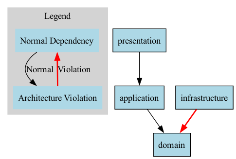

# Real-World Examples and Best Practices

This document provides additional examples and best practices for using GoArchTest in real-world scenarios.

## Setting Up Comprehensive Architecture Tests

Here's a complete example of how to set up comprehensive architecture tests for a typical Go project:

```go
package architecture_test

import (
	"os"
	"path/filepath"
	"testing"
	
	"github.com/solrac97gr/goarchtest"
)

func TestArchitecture(t *testing.T) {
	projectPath, err := filepath.Abs("./")
	if err != nil {
		t.Fatalf("Failed to get project path: %v", err)
	}
	
	types := goarchtest.InPath(projectPath)
	
	// 1. Test Clean Architecture rules
	t.Run("CleanArchitecture", func(t *testing.T) {
		// Domain should not depend on other layers
		result := types.That().
			ResideInNamespace("domain").
			ShouldNot().
			HaveDependencyOn("application").
			GetResult()
		
		if !result.IsSuccessful {
			t.Error("Domain should not depend on application layer")
			for _, failingType := range result.FailingTypes {
				t.Logf("  - %s in package %s", failingType.Name, failingType.Package)
			}
		}
		
		result = types.That().
			ResideInNamespace("domain").
			ShouldNot().
			HaveDependencyOn("infrastructure").
			GetResult()
		
		if !result.IsSuccessful {
			t.Error("Domain should not depend on infrastructure layer")
			for _, failingType := range result.FailingTypes {
				t.Logf("  - %s in package %s", failingType.Name, failingType.Package)
			}
		}
		
		// Application should not depend on infrastructure
		result = types.That().
			ResideInNamespace("application").
			ShouldNot().
			HaveDependencyOn("infrastructure").
			GetResult()
		
		if !result.IsSuccessful {
			t.Error("Application should not depend on infrastructure layer")
			for _, failingType := range result.FailingTypes {
				t.Logf("  - %s in package %s", failingType.Name, failingType.Package)
			}
		}
	})
	
	// 2. Test naming conventions
	t.Run("NamingConventions", func(t *testing.T) {
		// Services should end with "Service"
		result := types.That().
			ResideInNamespace("application").
			Should().
			HaveNameEndingWith("Service").
			GetResult()
		
		if !result.IsSuccessful {
			t.Error("Application services should end with 'Service'")
			for _, failingType := range result.FailingTypes {
				t.Logf("  - %s in package %s", failingType.Name, failingType.Package)
			}
		}
		
		// Repositories should end with "Repository"
		result = types.That().
			ResideInNamespace("infrastructure").
			Should().
			HaveNameEndingWith("Repository").
			GetResult()
		
		if !result.IsSuccessful {
			t.Error("Infrastructure repositories should end with 'Repository'")
			for _, failingType := range result.FailingTypes {
				t.Logf("  - %s in package %s", failingType.Name, failingType.Package)
			}
		}
	})
	
	// 3. Test for specific anti-patterns
	t.Run("AntiPatterns", func(t *testing.T) {
		// Controllers should not use fmt.Println (should use proper logging)
		result := types.That().
			ResideInNamespace("presentation").
			ShouldNot().
			HaveDependencyOn("fmt").
			GetResult()
		
		if !result.IsSuccessful {
			t.Error("Controllers should use proper logging, not fmt")
			for _, failingType := range result.FailingTypes {
				t.Logf("  - %s in package %s", failingType.Name, failingType.Package)
			}
		}
	})
	
	// 4. Generate visual report
	reporter := goarchtest.NewReporter()
	
	// Add results from multiple tests
	cleanArchPattern := goarchtest.CleanArchitecture("domain", "application", "infrastructure", "presentation")
	validationResults := cleanArchPattern.Validate(types)
	
	errorReporter := goarchtest.NewErrorReporter(os.Stderr)
	errorReporter.ReportPatternValidation(validationResults)
	
	// Save a dependency graph using GetAllTypes method
	allTypes := types.That().GetAllTypes()
	err = errorReporter.SaveDependencyGraph(allTypes, "architecture_dependencies.dot")
	if err != nil {
		t.Logf("Failed to generate dependency graph: %v", err)
	}
}
```

## Best Practices

### 1. Run Architecture Tests Early and Often

Add architecture tests to your CI/CD pipeline to catch violations early:

```yaml
# In your GitHub Actions workflow
jobs:
  architecture-tests:
    runs-on: ubuntu-latest
    steps:
      - uses: actions/checkout@v3
      - uses: actions/setup-go@v3
        with:
          go-version: '1.24'
      - name: Run Architecture Tests
        run: go test ./tests/architecture
```

### 2. Start Simple and Iterate

Begin with the most critical architectural boundaries and gradually add more tests:

1. First, ensure domain doesn't depend on infrastructure
2. Then add tests for naming conventions
3. Then add tests for package structure
4. Finally, add tests for specific patterns like CQRS, Event Sourcing, etc.

### 3. Use Custom Predicates for Project-Specific Rules

Custom predicates allow you to create project-specific architecture rules:

```go
// Define a custom predicate for Command handlers
isCommandHandler := func(typeInfo *goarchtest.TypeInfo) bool {
    return strings.HasSuffix(typeInfo.Name, "CommandHandler") && typeInfo.IsStruct
}

// Test that command handlers follow CQRS principles
result := types.That().
    WithCustomPredicate("IsCommandHandler", isCommandHandler).
    ShouldNot().
    HaveDependencyOn("query").
    GetResult()
```

### 4. Document Architecture with Tests

Architecture tests serve as living documentation of your design decisions:

```go
// File: tests/architecture/README.md
/*
# Architecture Tests

This package contains tests that verify our architectural constraints:

1. Clean Architecture layers (domain, application, infrastructure)
2. CQRS separation (commands vs queries)
3. Microservices boundaries
4. Dependency rules between modules

Run these tests with:
```
go test ./tests/architecture -v
```
*/
```

### 5. Visualize Architecture for Better Understanding

Generate visualization from your architecture tests:

```go
// Save dependency graph using GetAllTypes
reporter := goarchtest.NewErrorReporter(os.Stderr)
allTypes := types.That().GetAllTypes()
err := reporter.SaveDependencyGraph(allTypes, "architecture.dot")

// You can convert the DOT file to an image using Graphviz:
// dot -Tpng architecture.dot -o architecture.png
```

Here's an example of how a dependency graph looks for a Clean Architecture project:



This visualization clearly shows the dependency flow between packages, making it easier to:
- Verify architectural boundaries
- Identify violations (e.g., if domain depended on infrastructure)
- Communicate architectural design to team members
- Document the current state of your architecture

## Common Architectural Patterns and How to Test Them

### 1. Layered Architecture

```go
layeredArch := goarchtest.LayeredArchitecture(
    "presentation", // UI layer
    "application",  // Application logic
    "domain",       // Core business logic
    "infrastructure" // External concerns
)
results := layeredArch.Validate(types)
```

### 2. Hexagonal Architecture (Ports and Adapters)

```go
hexagonalArch := goarchtest.HexagonalArchitecture(
    "domain",  // Core
    "ports",   // Interfaces
    "adapters" // Implementations
)
results := hexagonalArch.Validate(types)
```

### 3. Microservices Architecture

```go
// Test that services are independent
result1 := types.That().
    ResideInNamespace("services/users").
    ShouldNot().
    HaveDependencyOn("services/products").
    GetResult()

// Test that services communicate via well-defined APIs
result2 := types.That().
    ResideInNamespace("services").
    And().
    HaveDependencyOn("services").
    Should().
    HaveDependencyOn("api/client").
    GetResult()
```

### 4. Event-Driven Architecture

```go
// Event publishers should not depend on event consumers
result := types.That().
    ImplementInterface("EventPublisher").
    ShouldNot().
    HaveDependencyOn("consumer").
    GetResult()

// Event handlers should follow naming convention
result = types.That().
    ImplementInterface("EventHandler").
    Should().
    HaveNameEndingWith("EventHandler").
    GetResult()
```
